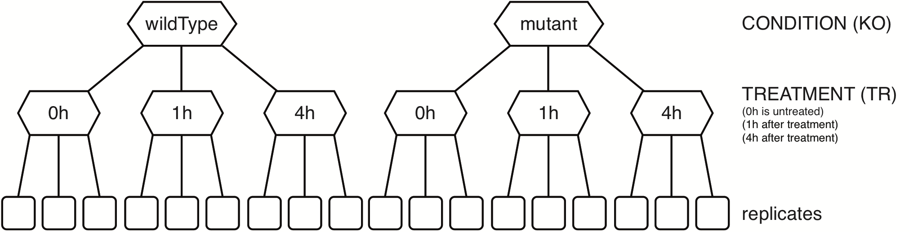

# Single/compound factor with several levels



Create a sample annotation table similar to this one (see also [sampleTab](MLNB_sampleTab.csv), note that the row names must correspond to the column names in the count table):

|          | KO       | TR |
|----------|----------|----|
| wt_0h_A  | wildType | 0h |
| wt_0h_B  | wildType | 0h |
| wt_0h_C  | wildType | 0h |
| wt_1h_A  | wildType | 1h |
| wt_1h_B  | wildType | 1h |
| wt_1h_C  | wildType | 1h |
| wt_4h_A  | wildType | 4h |
| wt_4h_B  | wildType | 4h |
| wt_4h_C  | wildType | 4h |
| mut_0h_A | mutant   | 0h |
| mut_0h_B | mutant   | 0h |
| mut_0h_C | mutant   | 0h |
| mut_1h_A | mutant   | 1h |
| mut_1h_B | mutant   | 1h |
| mut_1h_C | mutant   | 1h |
| mut_4h_A | mutant   | 4h |
| mut_4h_B | mutant   | 4h |
| mut_4h_C | mutant   | 4h |

```R
# Excel is quite RAM hungry - on low RAM machines use CSV files instead or set ensemble <- NA
options(java.parameters = "-Xmx8g")
library("biomaRt")
library("edgeR")
library("DESeq2")
library("limma")
library("XLConnect")
library("RNAseqWrapper")

# choose a working directory
rDir <- "/path/to/your/working/directory"

# if possible, use biomaRt to add the gene description in the DE-tables
# see the biomart manual for details. At the time I wrote this, biomart.org
# was not available and I therefore used the DB hosted at ensembl.org.
ensembl <- useMart("ENSEMBL_MART_ENSEMBL", dataset = "mmusculus_gene_ensembl", host="www.ensembl.org")
biomaRt:::martBM(ensembl) <- "ensembl" # to fix an error further down

# if not, set the ensembl variable to NA
ensembl <- NA

# load the table with the sample annotation
sampleTab <- read.csv(file.path(rDir, "sampleTab.csv"), row.names = 1, stringsAsFactors = FALSE)

rDir <- "/Users/marc/RNAseq_protocol/data"
sampleTab <- read.csv("/Users/marc/RNAseq_protocol/examples/MLNB_sampleTab.csv", row.names = 1, stringsAsFactors = FALSE)
myData <- read.table(file.path(rDir, "ML_counts.txt"), sep = '\t')

# combine the individual columns
sampleTab <- f.combine.factors.of.sample.table(sampleTab, c("KO", "TR"))

# convert the new variable to a factor and (optionally) specify the levels
sampleTab$KOxTR__ <- factor(sampleTab$KOxTR__, levels = c("wildType_0h", "wildType_1h", "wildType_4h",
                                                           "mutant_0h", "mutant_1h", "mutant_4h"))

# define the formula and create a design matrix
formulaString <- "~0+KOxTR__"
design <- model.matrix(formula(formulaString), data = sampleTab, contrasts.arg = NULL)

# specify the contrasts (see below the code chunk for explanations)
myCont <- makeContrasts(
  KO_at_0h = KOxTR__mutant_0h - KOxTR__wildType_0h,
  KO_at_1h = KOxTR__mutant_1h - KOxTR__wildType_1h,
  KO_at_4h = KOxTR__mutant_4h - KOxTR__wildType_4h,
  TR_1h_at_wildType = KOxTR__wildType_1h - KOxTR__wildType_0h,
  TR_4h_at_wildType = KOxTR__wildType_4h - KOxTR__wildType_0h,
  TR_1h_at_mutant = KOxTR__mutant_1h - KOxTR__mutant_0h,
  TR_4h_at_mutant = KOxTR__mutant_4h - KOxTR__mutant_0h,
  INT_at_1h = (KOxTR__mutant_1h - KOxTR__mutant_0h) - 
              (KOxTR__wildType_1h - KOxTR__wildType_0h),
  INT_at_4h = (KOxTR__mutant_4h - KOxTR__mutant_0h) - 
              (KOxTR__wildType_4h - KOxTR__wildType_0h),
  KO = ((KOxTR__mutant_0h - KOxTR__wildType_0h) + 
        (KOxTR__mutant_1h - KOxTR__wildType_1h) + 
        (KOxTR__mutant_4h - KOxTR__wildType_4h))/3,
  TR = ((KOxTR__mutant_1h-KOxTR__mutant_0h) + 
        (KOxTR__mutant_4h-KOxTR__mutant_0h) + 
        (KOxTR__wildType_1h-KOxTR__wildType_0h) + 
        (KOxTR__wildType_4h-KOxTR__wildType_0h))/4,
  levels = design)

# read the different data sets (either .csv or .txt)
myData <- read.csv(file.path(rDir, "myCountTable.csv"), row.names = 1)
myData <- read.table(file.path(rDir, "myCountTable.txt"), sep = '\t')

# remove entries with very low values (e.g. <5 in all samples)
myData <- f.strip.data(myData, minVal = 5, minTimes = 1)

# some overview plots - set skipScatters to TRUE if there are more than 16 samples
f.do.some.overview(log2(myData+1), rDir, "MLNB", skipScatters = FALSE)

# test for differential expression
# there are three different packages: DESeq2, edgeR or limma
# for edgeR, we have three different ways to estimate dispersion:
# common, trended and tagwise
# for limma, we have three different ways to pre-normalize the data:
# none, TMM (like edgeR) and quantile
# There are three separate functions:
# f.multi.level.edgeR
# f.multi.level.DESeq
# f.multi.level.limma
# Alternatively you may run all at once:
deResults <- f.multiple.multi.level.comparisons(myData, sampleTab, formulaString, myCont, design)

# for each DE-method, write all results into an Excel workbook:
for (deMethod in names(deResults)) {
  f.write.DEGtabs.to.workbook(deResults[[deMethod]], rDir, paste0("MLNB_", deMethod), ensembl)
}

# Alternatively write csv tables for each method and the individual results
for (DEmethod in names(deResults)) {
  for (comp in names(deResults[[DEmethod]])) {
    outTab <- deResults[[DEmethod]][[comp]]$get_table()
    write.csv(outTab, file.path(rDir, paste0(DEmethod, "_", comp, "_MLNB.csv")))
  }
}

#########################################################################################
# optional: get normalized data
# there are three different packages: DESeq2, edgeR or limma
# for the limma voom transformation one can in addition choose to
# first normalize the data with the method from edgeR (TMM) or with a
# quantile normalization method. There are three separate functions:
# f.normalize.counts.DESeq
# f.normalize.counts.edgeR
# f.normalize.counts.limma
# Alternatively you may run all at once:
myNormData <- f.all.normalizations(myData, sampleTab, formulaString, design)
# myNormData is a list with five data frames, the names are according to the
# normalization method:
# DESeq_default
# edgeR
# limma_none
# limma_TMM
# limma_quantile

# optional: calculate the mean/median/sum/sd within each condition
byTab <- data.frame(sample = rownames(sampleTab),
                    group = "KOxTR__",
                    stringsAsFactors = FALSE)
meanTab <- f.summarize.columns(myData, byTab, mean)
```

## Some words on the model:

y ~ 0 + KOxTR__

1. KOxTR__ (2*3 levels):
    + wildType_0h
    + wildType_1h
    + wildType_4h
    + mutant_0h
    + mutant_1h
    + mutant_4h
2. Contrast formulas:
    + KO_at_0h: mutant_0h - wildType_0h
    + KO_at_1h: mutant_1h - mock_1h
    + KO_at_4h: mutant_4h - mock_4h
    + TR_1h_at_wildType: wildType_1h - wildType_0h
    + TR_4h_at_wildType: wildType_4h - wildType_0h
    + TR_1h_at_art: art_1h - mutant_0h
    + TR_4h_at_art: art_4h - mutant_0h
    + INT_at_1h: (mutant_1h - mutant_0h) - (wildType_1h - wildType_0h)\
        simplified: TR_1h_at_mutant - TR_1h_at_wildType
    + INT_at_4h: (mutant_4h - mutant_0h) - (wildType_4h - wildType_0h)\
        simplified: TR_4h_at_mutant - TR_4h_at_wildType
    + KO: ((mutant_0h - wildType_0h) + (mutant_1h - wildType_1h) + (mutant_4h - wildType_4h))/3\
        simplified: (KO_at_0h + KO_at_1h + KO_at_2h)/3
    + LPS: ((mutant_1h - mutant_0h) + (mutant_4h - mutant_0h) + (wildType_1h - wildType_0h) + (wildType_4h - wildType_0h))/4\
        simplified: (TR_1h_at_wildType + TR_4h_at_wildType + TR_1h_at_mutant + TR_4h_at_mutant)/4
3. Questions addressed by the contrasts ("for a given gene, ..."):
    + KO_at_0h: does "the mutation" change its expression before "the treatment"?
    + KO_at_1h: does "the mutation" change its expression 1 hour after "the treatment"?
    + KO_at_4h: does "the mutation" change its expression 4 hours after "the treatment"?
    + TR_1h_at_wildType: does "the treatment" change its expression in wildType samples after 1 hour?
    + TR_4h_at_wildType: does "the treatment" change its expression in wildType samples after 4 hours?
    + TR_1h_at_mutant: does "the treatment" change its expression in mutant samples after 1 hour?
    + TR_4h_at_mutant: does "the treatment" change its expression in mutant samples after 4 hours?
    + INT_at_1h: is the effect of "the treatment" after 1 hour different in mutant samples compared to wildType samples?
    + INT_at_4h: is the effect of "the treatment" after 4 hours different in mutant samples compared to wildType samples?
    + KO: is there a consistent effect of "the mutation" across all time-points?
    + TR: is there a consistent effect of "the treatment" after 1 and 4 hours?

