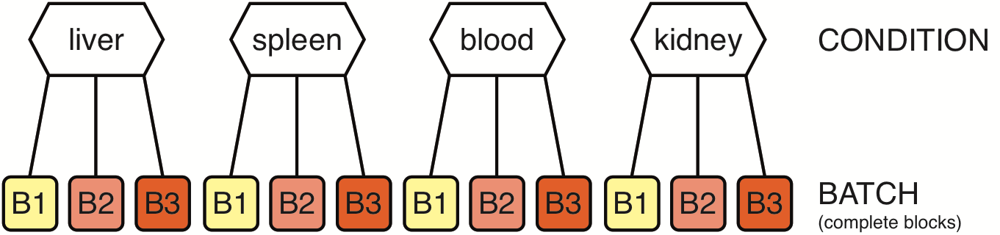

# Multiple pairwise comparisons with batch effect



Create a sample annotation table similar to this one (see also [sampleTab](MTGWB_sampleTab.csv), note that the row names must correspond to the column names in the count table):

|          | CONDITION | BATCH |
|----------|-----------|-------|
| liver_A  | liver     | B1    |
| liver_B  | liver     | B2    |
| liver_C  | liver     | B3    |
| spleen_A | spleen    | B1    |
| spleen_B | spleen    | B2    |
| spleen_C | spleen    | B3    |
| blood_A  | blood     | B1    |
| blood_B  | blood     | B2    |
| blood_C  | blood     | B3    |
| kidney_A | kidney    | B1    |
| kidney_B | kidney    | B2    |
| kidney_C | kidney    | B3    |

```R
# Excel is quite RAM hungry - on low RAM machines use CSV files instead or set ensemble <- NA
options(java.parameters = "-Xmx8g")
library("biomaRt")
library("edgeR")
library("DESeq2")
library("limma")
library("XLConnect")
library("RNAseqWrapper")

# choose a working directory
rDir <- "/path/to/your/working/directory"

# if possible, use biomaRt to add the gene description in the DE-tables
# see the biomart manual for details. At the time I wrote this, biomart.org
# was not available and I therefore used the DB hosted at ensembl.org.
ensembl <- useMart("ENSEMBL_MART_ENSEMBL", dataset = "mmusculus_gene_ensembl", host="www.ensembl.org")
biomaRt:::martBM(ensembl) <- "ensembl" # to fix an error further down

# if not, set the ensembl variable to NA
ensembl <- NA

# load the table with the sample annotation
sampleTab <- read.csv(file.path(rDir, "sampleTab.csv"), row.names = 1, stringsAsFactors = FALSE)

# read the different data sets (either .csv or .txt)
myData <- read.csv(file.path(rDir, "myCountTable.csv"), row.names = 1)
myData <- read.table(file.path(rDir, "myCountTable.txt"), sep = '\t')

# remove entries with very low values (e.g. <5 in all samples)
myData <- f.strip.data(myData, minVal = 5, minTimes = 1)

# some overview plots - set skipScatters to TRUE if there are more than 16 samples
f.do.some.overview(log2(myData+1), rDir, "MTGWB", skipScatters = FALSE)

# test for differential expression between all possible 
# combinations of CONDITION. To run it with all methods
# at once - there are two ways to nest the DE-methods
# and all the comparisons:
# To get an Excel workbook containing for each DE-method all
# possible pairwise combinations, use:
deResults <- f.multiple.all.pairwise.comparisons(myData, 
                                                 rownames(sampleTab), 
                                                 sampleTab$CONDITION,
                                                 sampleTab$BATCH)
# note that this can result in huge tables and too few RAM for 
# writing them to the Excel workbook.

# To get an Excel workbook containing for each pair all the
# different DE-methods, use:
deResults <- f.multiple.two.group.comparisons.pairwise(myData, 
                                                 rownames(sampleTab), 
                                                 sampleTab$CONDITION,
                                                 sampleTab$BATCH)

# To write the tables:
for (DEMorPC in names(deResults)) {
  f.write.DEGtabs.to.workbook(deResults[[DEMorPC]], rDir, paste0("MTGWB_", DEMorPC), ensembl)
  gc() # this is only necessary if you write many tables
}

# Alternatively write csv tables for each comparison and method
for (DEMorPC in names(deResults)) {
  for (PCorDEM in names(deResults[[DEMorPC]])) {
    outTab <- deResults[[DEMorPC]][[PCorDEM]]$get_table()
    write.csv(outTab, file.path(rDir, paste0(DEMorPC, "_", PCorDEM, "_MTGWB.csv")))
  }
}

#########################################################################################
# optional: get normalized data
# there are three different packages: DESeq2, edgeR or limma
# for the limma voom transformation one can in addition choose to
# first normalize the data with the method from edgeR (TMM) or with a
# quantile normalization method. There are three separate functions:
# f.normalize.counts.DESeq
# f.normalize.counts.edgeR
# f.normalize.counts.limma
# Alternatively you may run all at once:
formulaString <- "~BATCH+CONDITION"
design <- model.matrix(formula(formulaString), data = sampleTab, contrasts.arg = NULL)
myNormData <- f.all.normalizations(myData, sampleTab, formulaString,  design)
# myNormData is a list with five data frames, the names are according to the
# normalization method:
# DESeq_default
# edgeR
# limma_none
# limma_TMM
# limma_quantile

# optional: calculate the mean/median/sum/sd within each condition
byTab <- data.frame(sample = rownames(sampleTab),
                    group = sampleTab$CONDITION,
                    stringsAsFactors = FALSE)
meanTab <- f.summarize.columns(myData, byTab, mean)
```
