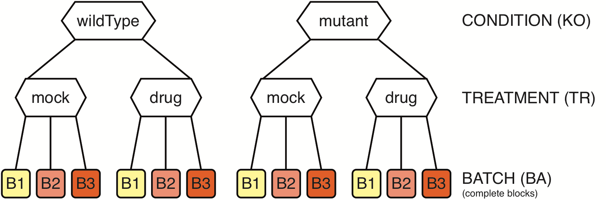

# Two-by-two factorial design with batch effect



Create a sample annotation table similar to this one (see also [sampleTab](TBTWB_sampleTab.csv), note that the row names must correspond to the column names in the count table):

|          | KO       | TR   | BA |
|----------|----------|------|----|
| wt_mo_A  | wildType | mock | B1 |
| wt_mo_B  | wildType | mock | B2 |
| wt_mo_C  | wildType | mock | B3 |
| wt_dr_A  | wildType | drug | B1 |
| wt_dr_B  | wildType | drug | B2 |
| wt_dr_C  | wildType | drug | B3 |
| mut_mo_A | mutant   | mock | B1 |
| mut_mo_B | mutant   | mock | B2 |
| mut_mo_C | mutant   | mock | B3 |
| mut_dr_A | mutant   | drug | B1 |
| mut_dr_B | mutant   | drug | B2 |
| mut_dr_C | mutant   | drug | B3 |

```R
# Excel is quite RAM hungry - on low RAM machines use CSV files instead or set ensemble <- NA
options(java.parameters = "-Xmx8g")
library("biomaRt")
library("edgeR")
library("DESeq2")
library("limma")
library("XLConnect")
library("RNAseqWrapper")

# choose a working directory
rDir <- "/path/to/your/working/directory"

# if possible, use biomaRt to add the gene description in the DE-tables
# see the biomart manual for details. At the time I wrote this, biomart.org
# was not available and I therefore used the DB hosted at ensembl.org.

# Choose a biomart database (only if you were using
# the corresponding reference genome and annotation).
# To display available marts and datasets for animals
# and plants (there may also be other hosts):
listMarts(host = "www.ensembl.org")     # animals
listMarts(host = "plants.ensembl.org")  # plants

# Connect to a database and check whether there
# is a dataset for -e.g.- Arabidopsis available:
ensembl <- useMart("plants_mart", host = "plants.ensembl.org")
ensemblDatasets <- listDatasets(ensembl)
ensemblDatasets[grep("Arabidopsis", ensemblDatasets$description),]

# Finally connect to the database for A. thaliana:
ensembl <- useDataset("athaliana_eg_gene", mart = ensembl)

# Set the class of the biomart DB to "ensembl".
# Note that this is a simple error-workaround
# which is only necessary for some hosts.
# I'm not sure if it is still necessary.
biomaRt:::martBM(ensembl) <- "ensembl"

# if not, set the ensembl variable to NA
ensembl <- NA

# load the table with the sample annotation
sampleTab <- read.csv(file.path(rDir, "sampleTab.csv"), row.names = 1, stringsAsFactors = FALSE)

# set the order of the levels to specify which sample is the reference
# this is not crucial, but it's beneficial to always set the untreated
# or wild type sample as a reference.
sampleTab$KO <- factor(sampleTab$KO, levels = c("wildType", "mutant"))
sampleTab$TR <- factor(sampleTab$TR, levels = c("mock", "drug"))
sampleTab$BA <- factor(sampleTab$BA) # order is irrelevant for the batch

# read the different data sets (either .csv or .txt)
myData <- read.csv(file.path(rDir, "myCountTable.csv"), row.names = 1)
myData <- read.table(file.path(rDir, "myCountTable.txt"), sep = '\t')

# remove entries with very low values (e.g. <5 in all samples)
myData <- f.strip.data(myData, minVal = 5, minTimes = 1)

# some overview plots - set skipScatters to TRUE if there are more than 16 samples
f.do.some.overview(log2(myData+1), rDir, "TBTWB", skipScatters = FALSE)

# test for differential expression
# there are three different packages: DESeq2, edgeR or limma
# for edgeR, we have three different ways to estimate dispersion:
# common, trended and tagwise
# for limma, we have three different ways to pre-normalize the data:
# none, TMM (like edgeR) and quantile
# There are three separate functions:
# f.two.by.two.edgeR
# f.two.by.two.DESeq
# f.two.by.two.limma
# Alternatively you may run all at once:
deResults <- f.multiple.two.by.two.comparisons(myData, sampleTab, "KO", "TR", "BA")

# for each DE-method, write all results into an Excel workbook:
for (deMethod in names(deResults)) {
  f.write.DEGtabs.to.workbook(deResults[[deMethod]], rDir, paste0("TBTWB_", deMethod), ensembl)
}

# Alternatively write csv tables for each method and the individual results
for (DEmethod in names(deResults)) {
  for (comp in names(deResults[[DEmethod]])) {
    outTab <- deResults[[DEmethod]][[comp]]$get_table()
    write.csv(outTab, file.path(rDir, paste0(DEmethod, "_", comp, ".csv")))
  }
}

#########################################################################################
# optional: get normalized data
# there are three different packages: DESeq2, edgeR or limma
# for the limma voom transformation one can in addition choose to
# first normalize the data with the method from edgeR (TMM) or with a
# quantile normalization method. There are three separate functions:
# f.normalize.counts.DESeq
# f.normalize.counts.edgeR
# f.normalize.counts.limma
# Alternatively you may run all at once:
helpers <- f.prepare.two.by.two.analysis(sampleTab, "KO", "TR", "BA")
myNormData <- f.all.normalizations(myData, sampleTab, helpers$formulaString, helpers$design)
# myNormData is a list with five data frames, the names are according to the
# normalization method:
# DESeq_default
# edgeR
# limma_none
# limma_TMM
# limma_quantile

# optional: calculate the mean/median/sum/sd within each condition
byTab <- data.frame(sample = rownames(sampleTab),
                    group = paste0(sampleTab$KO, "_", sampleTab$TR),
                    stringsAsFactors = FALSE)
meanTab <- f.summarize.columns(myData, byTab, mean)
```

## Some words on the model

y ~ BA + KO*TR

1. KO (2 levels):
    + wildType
    + mutant
2. TR (2 levels):
    + mock
    + drug
3. BA:
    + three complete blocks (triplicates)
4. Contrast formulas:
    + mutant_vs_wildType_in_mock: art_mock - wildType_mock
    + mutant_vs_wildType_in_drug: mutant_drug - wildType_drug
    + 1h_vs_mock_in_wildType: wildType_drug - wildType_mock
    + 1h_vs_mock_in_mutant: mutant_drug - mutant_mock
    + KO_x_TR: (mutant_drug - mutant_mock) - (wildType_drug - wildType_mock)\
        simplified: drug_vs_mock_in_mutant - drug_vs_mock_in_wildType
5. Questions addressed by the contrasts ("for a given gene, ..."):
    + mutant_vs_wildType_in_mock: does "the mutation" change its expression before "the treatment"?
    + mutant_vs_wildType_in_drug: does "the mutation" change its expression after "the treatment"?
    + drug_vs_mock_in_wildType: does "the treatment" change its expression in wildType samples?
    + drug_vs_mock_in_mutant: does "the treatment" change its expression in mutant samples?
    + KO_x_TR: is the effect of "the treatment" different in mutant samples compared to wildType samples?

