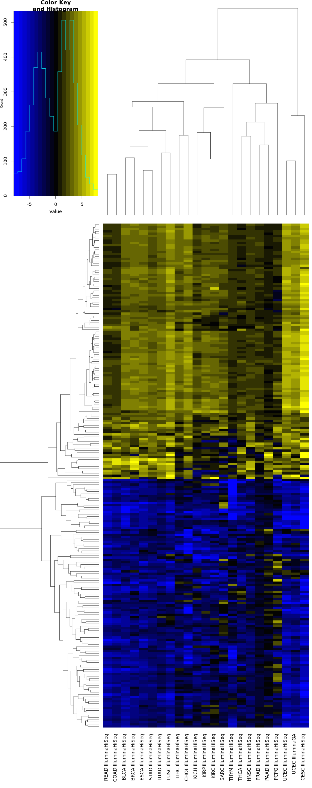

# The Cancer Genome Atlas - paired samples

The data provided below is taken from [TCGA](http://cancergenome.nih.gov/). It contains the RNA-Seq V2 data (RSEM, gene level, raw) for all publicly available data sets (April 2016). In total there would be around 11'700 samples. However, many of them were not sampled in a "paired fashion" (for most patients/participants there is only data on the tumor sample available). The data below is restricted to the paired cases - meaning that we have both, normal and tumor tissue samples, for one study participant (this are almost exclusively sample types "NT" and "PT" - I therefore restricted it further to those two; see [TCGA-Barcode](https://wiki.nci.nih.gov/display/TCGA/Working+with+TCGA+Data#WebServices-Barcode-UUIDMapping) for more explanations). The sample annotation table is based on the TCGA barcodes. Note that I added "uuid_" in front of the UUIDs. The reason for this is that they frequently start with a number, which does not work if you want to use them as colnames() in R. 

Download [the archive with the data and the annotation](TCGA_pairedData.zip?raw=true) and unpack it. Place the file into the working directory specified in the script.

## Identify genes differentially expressed between normal and tumor tissues - for each cancer type

Warning: The script requires quite some RAM. You should have at least 24 GB.

```R
library("RNAseqWrapper")

# choose a working directory
rDir <- "/path/to/your/working/directory"

# load the data
sampleTab <- read.csv(file.path(rDir, "pairedSamplesAnnotation.csv"), colClasses = "character")
myData <- read.csv(file.path(rDir, "pairedSamplesRaw.csv"), row.names = 1)

# set some parameters
maxFDR <- 1e-6
minLFC <- 2
minimalNumberOfParticipants <- 3
participantsPerStudy <- aggregate(sampleTab$participant, by = list(study = sampleTab$dataSet), function(x) length(unique(x)), simplify = TRUE)
dataSets <- participantsPerStudy$study[participantsPerStudy$x >= minimalNumberOfParticipants]

# do one pairwise comparison per cancer type - normal vs tumor
# use the patient/participant ID as batch (treat it as paired)
# we are now only using edgeR with trended dispersion estimates.
# Feel free to try something else.
pairwiseResults <- list()
for (CSS in dataSets) {
  cat(CSS, "\n")
  subSampleTab <- subset(sampleTab, dataSet == CSS)
  subData <- myData[,subSampleTab$uuid]
  pairwiseResults[[CSS]] <- f.two.groups.edgeR(subData, subSampleTab$sampleType,
                                               c("NT", "TP"), method = "trended", 
                                               batch = subSampleTab$participant)
  # the logFCs correspond now to tumor-normal
}

# write out the results for each comparison
for (CSS in names(pairwiseResults)) {
  cat(CSS, "\n")
  deTab <- pairwiseResults[[CSS]]$get_table()
  write.csv(deTab, file.path(rDir, paste0("PWWB_", CSS, ".csv")))
}

#########################################################################################
# you might be interested in a specific gene - extract the results for it
myGeneOfInterest <- "<entrezSymbol>|<entrezID>"
singleGeneResults <- list()
for (CSS in names(pairwiseResults)) {
  deTab <- pairwiseResults[[CSS]]$get_table()
  singleGeneResults[[CSS]] <- c(CSS, deTab[myGeneOfInterest,], 
                                length(unique(subset(sampleTab, dataSet == CSS)$participant)),
                                superSetDesc[unlist(strsplit(CSS, ".", TRUE))[1], "disease"])
}
singleGeneResults <- do.call("rbind", singleGeneResults)
colnames(singleGeneResults) <- c("cancerType", "logCPM", "logFC", "pVal", "adjP", "numParticipants", "cancerDescription")
write.csv(singleGeneResults, file.path(rDir, "singleGeneResult.csv"), row.names = FALSE)

#########################################################################################
# you could also try to get the genes which are consistently enriched in either normal or tumor tissue
# across several different types of cancer. Get binary matrices for significant or not:
deMat <- list(
  normal = matrix(0, nrow = nrow(myData), ncol = length(dataSets), dimnames = list(rownames(myData), dataSets)),
  tumor = matrix(0, nrow = nrow(myData), ncol = length(dataSets), dimnames = list(rownames(myData), dataSets))
)
for (CSS in dataSets) {
  temp <- pairwiseResults[[CSS]]$get_significant_entries(1, maxFDR, minLFC)
  deMat$normal[temp$NT, CSS] <- 1
  deMat$tumor[temp$TP, CSS] <- 1
}

# count how often a gene was significantly upregulated in tumor/normal tissue
deCounts <- lapply(deMat, function(x) sort(apply(x, 1, sum), decreasing = TRUE))

head(deCounts$tumor) # top tumor
head(deCounts$normal) # top normal
sum(deCounts$tumor > 10)
sum(deCounts$normal > 10)

#########################################################################################
# plot a heatmap with the top DE genes - average logFCs in all the studies tested
library("gplots")

# normalize the data
normData <- list(
  logCounts = f.normalize.counts.edgeR(myData, logCPM = FALSE),
  logCPM = f.normalize.counts.edgeR(myData, logCPM = TRUE)
)

# get logFCs
sum(table(sampleTab$participant) != 2) # ok - now they are really all paired
sampleTab <- sampleTab[with(sampleTab, order(participant, sampleType)),]
sampleTab$participant <- paste0("part_", sampleTab$participant)
uuidSortedNT <- sampleTab$uuid[sampleTab$sampleType=="NT"]
uuidSortedTP <- sampleTab$uuid[sampleTab$sampleType=="TP"]
partSorted <- sampleTab$participant[sampleTab$sampleType=="TP"]
lfcData <- lapply(normData, function(x) x[,uuidSortedTP]-x[,uuidSortedNT])
for (nds in names(lfcData)) {colnames(lfcData[[nds]]) <- partSorted}

# average the LFC
byTab <- data.frame(sample=sampleTab$participant, group=sampleTab$dataSet, stringsAsFactors = FALSE)
aveLFCdata <- lapply(lfcData, function(x) f.summarize.columns(x, byTab, mean))

# plot them
numCols <- 21
metaMarker <- lapply(deCounts, function(x) names(x)[x > 10])
for (nds in names(aveLFCdata)) {
  tiff(file.path(rDir, paste0("topMarkers_", nds, ".tiff")), width = 1600, height = 3200, compression = "lzw", pointsize = 24)
  heatmap.2(aveLFCdata[[nds]][unlist(metaMarker),], col = RNAseqWrapper:::f.blueblackyellow(numCols), trace="none", scale = "none", margins = c(15,15), breaks = seq(-8, 8, length.out = numCols+1))
  dev.off()
}

# write out the csvs
for (nds in names(aveLFCdata)) {
  write.csv(aveLFCdata[[nds]][unlist(metaMarker),], file.path(rDir, paste0("topMarkers_", nds, ".csv")))
}
```



