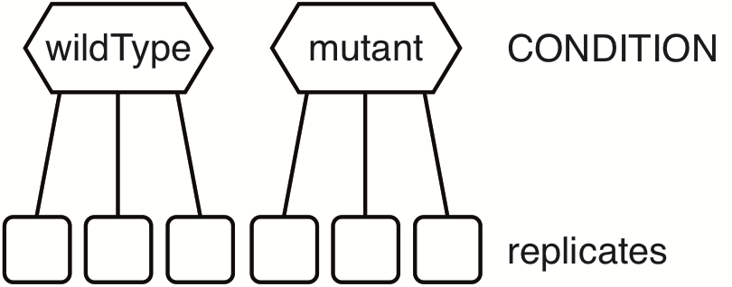

# Two groups



Create a sample annotation table similar to this one (see also [sampleTab](TGNB_sampleTab.csv), note that the row names must correspond to the column names in the count table):

|        | CONDITION |
|--------|-----------|
| CTRL_A | wildType  |
| CTRL_B | wildType  |
| CTRL_C | wildType  |
| KO_A   | mutant    |
| KO_B   | mutant    |
| KO_C   | mutant    |

```R
# Excel is quite RAM hungry - on low RAM machines use CSV files instead or set ensemble <- NA
options(java.parameters = "-Xmx8g")
library("biomaRt")
library("edgeR")
library("DESeq2")
library("limma")
library("XLConnect")
library("RNAseqWrapper")

# choose a working directory
rDir <- "/path/to/your/working/directory"

# if possible, use biomaRt to add the gene description in the DE-tables
# see the biomart manual for details. At the time I wrote this, biomart.org
# was not available and I therefore used the DB hosted at ensembl.org.

# Choose a biomart database (only if you were using
# the corresponding reference genome and annotation).
# To display available marts and datasets for animals
# and plants (there may also be other hosts):
listMarts(host = "www.ensembl.org")     # animals
listMarts(host = "plants.ensembl.org")  # plants

# Connect to a database and check whether there
# is a dataset for -e.g.- Arabidopsis available:
ensembl <- useMart("plants_mart", host = "plants.ensembl.org")
ensemblDatasets <- listDatasets(ensembl)
ensemblDatasets[grep("Arabidopsis", ensemblDatasets$description),]

# Finally connect to the database for A. thaliana:
ensembl <- useDataset("athaliana_eg_gene", mart = ensembl)

# Set the class of the biomart DB to "ensembl".
# Note that this is a simple error-workaround
# which is only necessary for some hosts.
# I'm not sure if it is still necessary.
biomaRt:::martBM(ensembl) <- "ensembl"

# if not, set the ensembl variable to NA
ensembl <- NA

# load the table with the sample annotation
sampleTab <- read.csv(file.path(rDir, "sampleTab.csv"), row.names = 1, stringsAsFactors = FALSE)

# read the different data sets (either .csv or .txt)
myData <- read.csv(file.path(rDir, "myCountTable.csv"), row.names = 1)
myData <- read.table(file.path(rDir, "myCountTable.txt"), sep = '\t')

# remove entries with very low values (e.g. <5 in all samples)
myData <- f.strip.data(myData, minVal = 5, minTimes = 1)

# some overview plots - set skipScatters to TRUE if there are more than 16 samples
f.do.some.overview(log2(myData+1), rDir, "TGNB", skipScatters = FALSE)

# test for differential expression
# there are three different packages: DESeq2, edgeR or limma
# for edgeR, we have three different ways to estimate dispersion:
# common, trended and tagwise
# for limma, we have three different ways to pre-normalize the data:
# none, TMM (like edgeR) and quantile
# There are three separate functions:
# f.two.groups.edgeR
# f.two.groups.DESeq
# f.two.groups.limma
# Alternatively you may run all at once:
comp <- c("wildType", "mutant") # the logFCs correspond now to mutant-wildType
deResults <- f.multiple.two.group.comparisons(myData, sampleTab$CONDITION, comp)

# write all results into an Excel workbook
f.write.DEGtabs.to.workbook(deResults, rDir, "TGNB", ensembl)

# Alternatively write csv tables for each comparison and method
for (DEmethod in names(deResults)) {
  outTab <- deResults[[DEmethod]]$get_table()
  write.csv(outTab, file.path(rDir, paste0(DEmethod, "_TGNB.csv")))
}

#########################################################################################
# optional: get normalized data
# there are three different packages: DESeq2, edgeR or limma
# for the limma voom transformation one can in addition choose to
# first normalize the data with the method from edgeR (TMM) or with a
# quantile normalization method. There are three separate functions:
# f.normalize.counts.DESeq
# f.normalize.counts.edgeR
# f.normalize.counts.limma
# Alternatively you may run all at once:
formulaString <- "~0+CONDITION"
design <- model.matrix(formula(formulaString), data = sampleTab, contrasts.arg = NULL)
myNormData <- f.all.normalizations(myData, sampleTab, formulaString,  design)
# myNormData is a list with five data frames, the names are according to the
# normalization method:
# DESeq_default
# edgeR
# limma_none
# limma_TMM
# limma_quantile

# optional: calculate the mean/median/sum/sd within each condition
byTab <- data.frame(sample = rownames(sampleTab),
                    group = sampleTab$CONDITION,
                    stringsAsFactors = FALSE)
meanTab <- f.summarize.columns(myData, byTab, mean)
```
